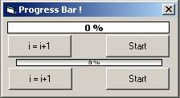



## Cool graphical progress bar

### Description

This is a cool progress bar.You can change

it base and bar picture whatever you want.It uses

only one api call.I think it is great.What do you think? Don't forget me and Please please........vote for me
 
### More Info
 

             |
---                |---
**Submitted On**   |2002-06-09 09:49:00
**By**             |[Pallab Mahmud](https://github.com/Planet-Source-Code/PSCIndex/blob/master/ByAuthor/pallab-mahmud.md)
**Level**          |Beginner
**User Rating**    |4.5 (18 globes from 4 users)
**Compatibility**  |VB 5\.0, VB 6\.0
**Category**       |[Custom Controls/ Forms/  Menus](https://github.com/Planet-Source-Code/PSCIndex/blob/master/ByCategory/custom-controls-forms-menus__1-4.md)
**World**          |[Visual Basic](https://github.com/Planet-Source-Code/PSCIndex/blob/master/ByWorld/visual-basic.md)
**Archive File**   |[Cool\_graph92124692002\.zip](https://github.com/Planet-Source-Code/pallab-mahmud-cool-graphical-progress-bar__1-35652/archive/master.zip)

